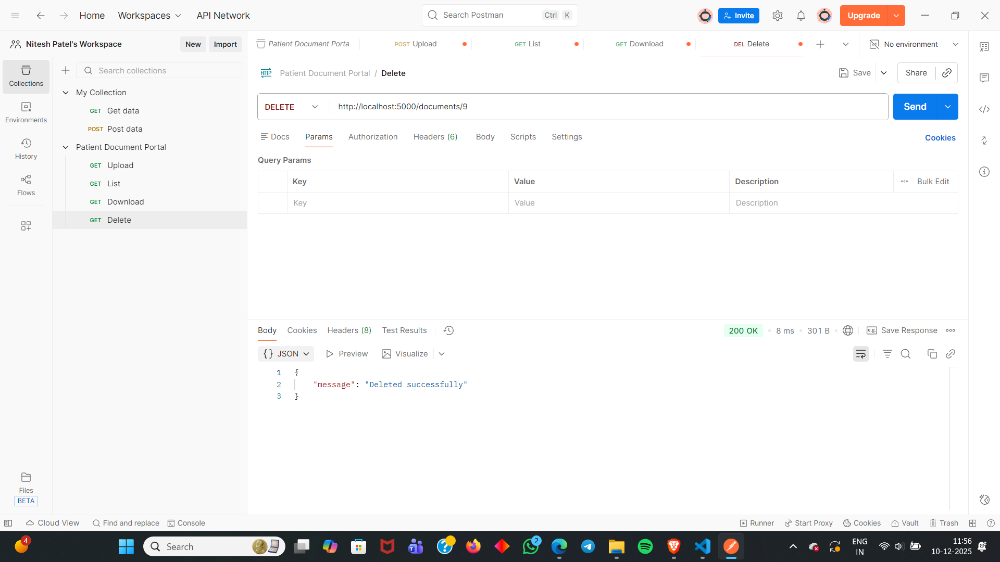

# **📘 Patient Document Portal **

A simple full-stack application where patients can **upload, view, download, and delete medical documents (PDFs)**.
This project uses:

* **React** for frontend
* **Express.js + express-fileupload** for backend
* **SQLite** as database
* **Local file storage** inside `/uploads` folder

# 📁 **Project Structure**

```
ini8-labs-assignment/
│── backend/
│     ├── controllers/
│     │      ├── uploadController.js
│     │      ├── listController.js
│     │      ├── downloadController.js
│     │      └── deleteController.js
│     ├── routes/
│     │      └── documentRoutes.js
│     ├── config/
│     │      └── db.js
│     ├── uploads/
│     ├── server.js
│     
│── frontend/
│     ├── src/
│     │     ├── components/
│     │     ├── App.js
│     │     └── index.js
│     ├── package.json
│
│── design.md
│── README.md
```

---

# 🛠️ **Tech Stack**

### **Frontend**

* React.js
* Axios

### **Backend**

* Node.js
* Express.js
* express-fileupload
* SQLite3

### **Database**

* SQLite (file-based, no installation required)

---

# ⚙️ **How to Run Locally**

## **1️⃣ Clone the Repository**

```sh
git clone https://github.com/<your-username>/ini8-labs-assignment.git
cd ini8-labs-assignment
```

---

# 🖥️ **Backend Setup**

```
cd backend
npm install
```

### **Start Server**

```sh
node server.js
```

Server starts on:

```
http://localhost:5000
```

### **Backend Environment**

* Files automatically store in:
  `backend/uploads/`
* Database file auto-created:
  `backend/database.db`

---

# 🌐 **Frontend Setup**

```
cd frontend
npm install
npm start
```

Frontend runs at:

```
http://localhost:3000
```

---

# 📡 **API Documentation**

## 📌 **1. Upload PDF**

**POST** `/documents/upload`

### **Curl**

```sh
curl -X POST http://localhost:5000/documents/upload \
  -F "file=@yourfile.pdf"
```

### **Response**

```json
{
  "message": "File uploaded",
  "id": 1
}
```

---

## 📌 **2. List all documents**

**GET** `/documents`

### Curl

```sh
curl http://localhost:5000/documents
```

### Response

```json
[
  {
    "id": 1,
    "filename": "report.pdf",
    "filepath": "/uploads/report.pdf",
    "filesize": 102400,
    "created_at": "2025-02-11 15:00:00"
  }
]
```

---

## 📌 **3. Download PDF**

**GET** `/documents/:id`

### Curl

```sh
curl -O http://localhost:5000/documents/1
```

This downloads the file.

---

## 📌 **4. Delete PDF**

**DELETE** `/documents/:id`

### Curl

```sh
curl -X DELETE http://localhost:5000/documents/1
```

### Response

```json
{
  "message": "Deleted successfully"
}
```

---

# 📬 **Postman Collection (Manual)**

### Upload


### List


### Download


### Delete



---
